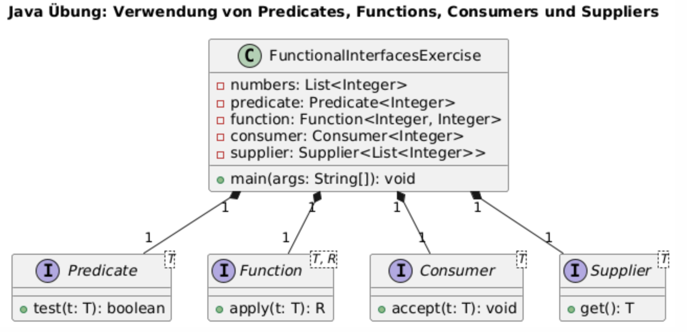

= Java Übung: Verwendung von Predicates, Functions, Consumers und Suppliers

== Ziel
In dieser Übung wirst du Java-Funktionsschnittstellen verwenden, um die Nutzung von `Predicate`, `Function`, `Consumer` und `Supplier` zu verstehen.

== Voraussetzungen
- Grundkenntnisse in Java
- Verständnis von Lambda-Ausdrücken und Funktionsschnittstellen

== Aufgabenstellung

Schreibe eine Java-Anwendung, die eine Liste von Zahlen verarbeitet und die folgenden Anforderungen erfüllt:

1. Verwende ein `Predicate` zum Filtern der Liste. Nur gerade Zahlen sollen in die Ergebnisliste aufgenommen werden.

2. Nutze eine `Function`, um jede Zahl in der gefilterten Liste zu verdoppeln.

3. Wende einen `Consumer` an, um jede verdoppelte Zahl in der Konsole auszugeben.

4. Verwende einen `Supplier`, um eine neue Liste zu erstellen, wenn die ursprüngliche Liste leer ist. Diese neue Liste soll eine feste Anzahl von Zufallszahlen enthalten.



== Hinweise

- Importiere die benötigten Funktionsschnittstellen aus dem `java.util.function`-Paket.
- Du kannst die `List`-Klasse und Methoden aus dem `java.util`-Paket nutzen.

== Beispielstruktur

```java
import java.util.List;
import java.util.ArrayList;
import java.util.Random;
import java.util.function.Predicate;
import java.util.function.Function;
import java.util.function.Consumer;
import java.util.function.Supplier;

public class FunctionalInterfacesExercise {

    public static void main(String[] args) {
        // Beispiel-Implementierung
    }
}
